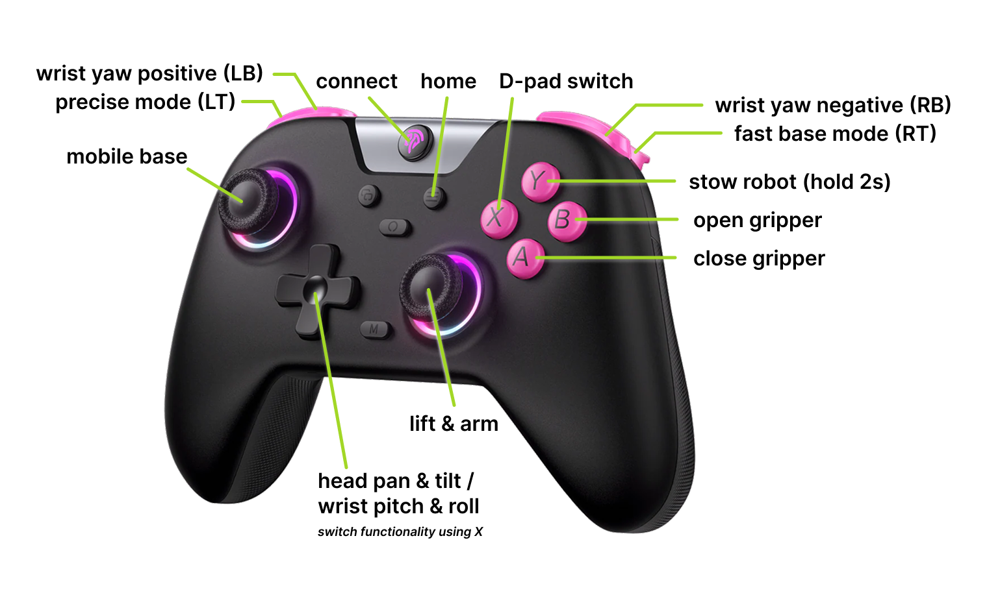

# CS 334 Robot Documentation: Stretch

This repository contains resources to get you started with using the SRC's Stretch 3 robot!

To begin, read these two pieces of official documentation from Hello Robot.

1. [Stretch Docs - Hello Robot!](https://docs.hello-robot.com/0.3/getting_started/hello_robot/) introduces you to the basic power on/off, charging, and teleoperation procedures of the robot.
2. [Stretch Docs - Safety Guide](https://docs.hello-robot.com/0.3/hardware/safety_guide) provides more detailed instruction on important safety procedures to follow when operating the robot.

## [0] General notes
- In case of emergency, you can always press the runstop button (side of the head) to disable the robot.
- The battery life varies, and averages around ~1 hour. Watch the [battery indicator](https://docs.hello-robot.com/0.3/hardware/battery_maintenance_guide_se3/#state-of-battery-charge) to make sure the robot doesn't run out of power while you are working on it.

## [1] Startup procedure

1. Flip the power switch and wait a few seconds for the motors to start before removing the clamp from the lift.
2. Upon startup, the robot must be homed before it can be moved. Run the homing procedure through the command line with `stretch_robot_home.py` or `home`.

## [2] Shutdown procedure

1. If the arm is extended, retract it first.
2. Clamp the arm on the lift under the shoulder.
3. Shut down the robot computer (`sudo shutdown -h now` or however else)
4. Turn off the power switch.
5. Plug in the robot in the room, and check the [indicator on the charger](https://docs.hello-robot.com/0.3/hardware/battery_maintenance_guide_se3/#noco-genius-10-interface) to make sure it is indeed charging! The white light should be in the box labelled 12V AGM.

## [3] Connecting to the robot

Connect to the robot either through SSH or directly on the onboard computer.

### a. SSH

1. Make sure your laptop is on a Stanford network (eduroam is ok).
2. Check that the robot is connected to the SRC network. 
3. Connect by running `ssh USER@ROBOT_IP` and enter your password when prompted.
    
    
    | ROBOT | IP ADDRESS |
    | --- | --- |
    | **inky** | 171.64.68.11 |

    By default students should use the shared `cs334` user account, which you will receive the password to upon completion of training. If a project requires more involved configuration of the robot, discuss with course staff about setting up a separate user account.

### b. Direct connection

1. Use the monitor, keyboard, and mouse on the rolling cart in the robot room.
    1. *There might be multiple keyboards.. use the one that has a built-in trackpad.*
2. Plug in the cart (this should be the thickest cable). It’s not enough to just plug in the monitor!
3. Turn on the monitor (rightmost button) and switch it into DVI input mode (second rightmost button). 

**Common issues:**

- The robot communicates with the monitor through a wireless HDMI dongle. There is a transmitter on the robot and a receiver connected to the monitor. In the case of a connection issue between the transmitter and receiver, a blue screen with pairing instructions will appear on the monitor.
- Double check that everything is turned on and plugged in: the cart (switch in the back), the power extender, the HDMI receiver, and the monitor.

## [4] Controlling the robot

The robot can be controlled through game teleoperation or with Python code.

### a. Gamepad teleoperation

Run the gamepad teleop script in the terminal (`stretch_gamepad_teleop.py` or `gamepad`). Then follow the [Gamepad Teleoperation intructions](https://docs.hello-robot.com/0.3/getting_started/hello_robot/#gamepad-teleoperation) to connect the gamepad controller and move the robot.



### b. Python

To control the robot with Python commands, first take a look at this [Writing Code tutorial](https://docs.hello-robot.com/0.3/getting_started/writing_code/) on getting started with the Stretch Body Robot API. Then, reference [Commanding Stretch to Move](https://docs.hello-robot.com/0.3/python/moving/) to explore the various robot joints and methods of control.

To manage code on the robot, each student should create a directory under `~/student_code` with their SUNet ID (e.g. `~/student_code/mpan8`). Dependencies should be managed using [venv](https://docs.python.org/3/library/venv.html):
1. From within the student directory, create a virtual environment with `python -m venv .venv`
2. Activate the environment upon starting the robot wih `source .venv/bin/activate`. All dependencies must be installed within this environment.

There are two code examples in the `examples/` folder that demonstrate how to work with the camera on the robot's head.

## [5] Transporting the robot

- If you’re manually moving the robot, make sure there is no program controlling the base (free the robot processes if unsure)
- Note that if you tilt the robot and roll it, the orientation of the head camera may shift
- You can hold the robot room door open by pressing the handicap door button on the inside or outside (from the outside, only after you’ve scanned your ID)

## [6] Extras

It can be helpful to define some aliases for commands you use often. Here are some that you can add to the end of your `.bashrc` 

```bash
alias python='python3'

alias free='stretch_free_robot_process.py'
alias home='stretch_robot_home.py'
alias stow='stretch_robot_stow.py'
alias gamepad='stretch_gamepad_teleop.py'
```

Typing `stretch_` into the terminal and hitting `TAB`, will display suggestions for other useful scripts that perform basic operations or provide robot telemetry.